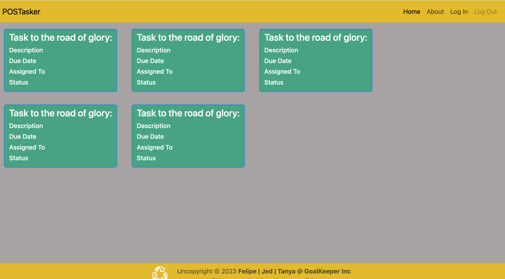
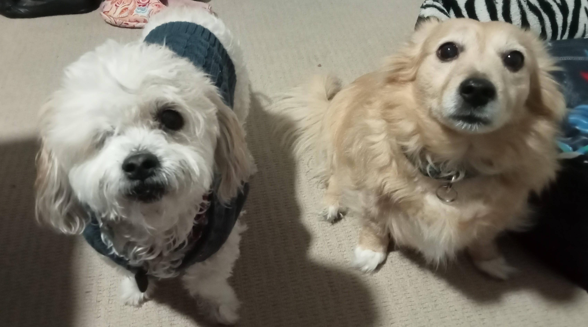

# Task-Planner

## What is this?

This repo provides the platform to organise tasks to do, in progress, up for review and completed, as well with a search function.

## Why we used the technologies we used:

We used HTML, CSS, Bootstrap & Javascript to enable flexibility to manipulate our layout and form structure. Some of the challenges we faced was learning to adjust the padding for the category columns and our footer, the steps of the range slide bar, the search bar function and avoiding duplication of task cards, modifying Bootstrap, how to filter with Regex, and learning to initiate local storage. Features we hoped to implement in the future would be to incorporate a filing system for 'done' tasks to be stored and retrieved to be referred to later, multiple user interactivity and priority sorting.

## How to use this project:

We have implemented a modal. This allows a new task item to be logged from the UI with details including the name, description, person assigned to, due date, status and then edited if required.

The data is reflected on the UI via cards displaying an outline of each task. These align with their status in columns of 'to do', 'in progress', 'review' and 'done. The cards can be edited through the modal should data change. When complete, a 'tick' done icon on the card converts the status to 'done'.

The future goal will be to assign the cards to a filing system so that the 'done' column does not overflow visually. A scroll bar on the X and Y axis has been placed to allow access to extend the display.

## Live view of the website

## Credits

Thanks to the following contributors for their tireless perseverance to overcome adversity and build the site:

Tanya 'cowgirl' Heuke, Jed 'dragon' Potter, Felipe 'spaceman' Marin and the hounds Clarice, Spirit, Charlie and Maggie.

